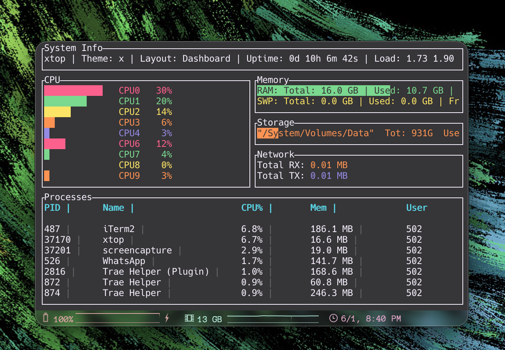
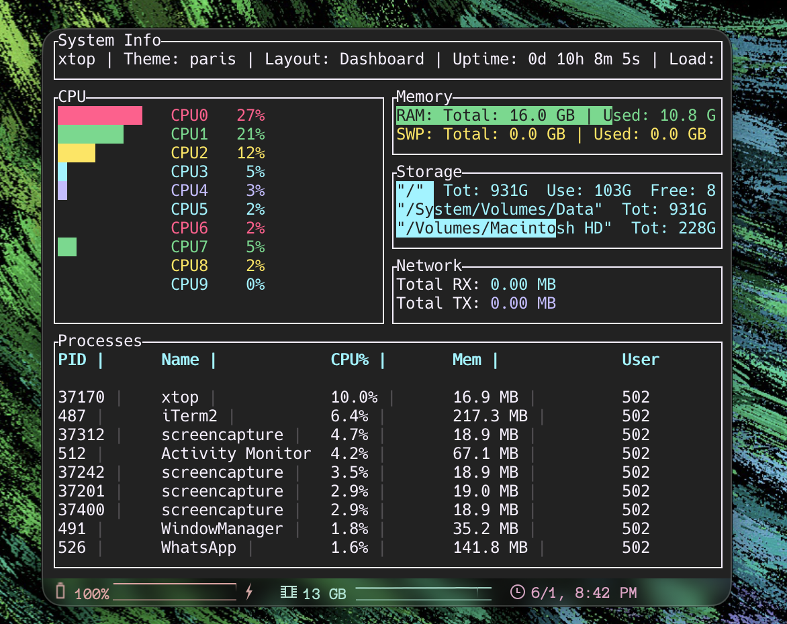
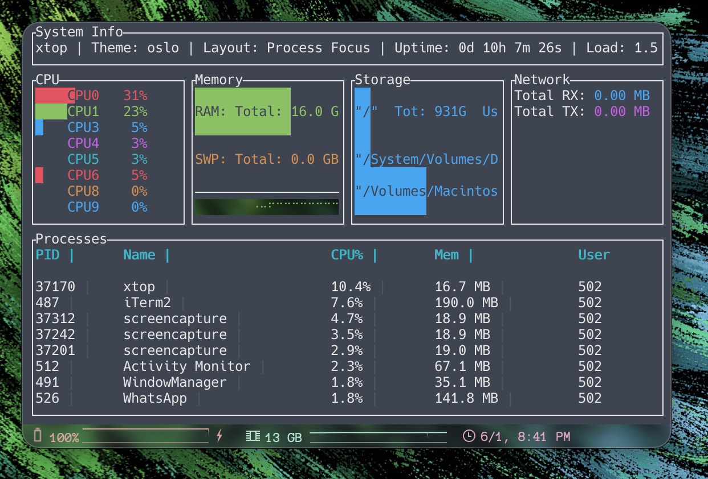
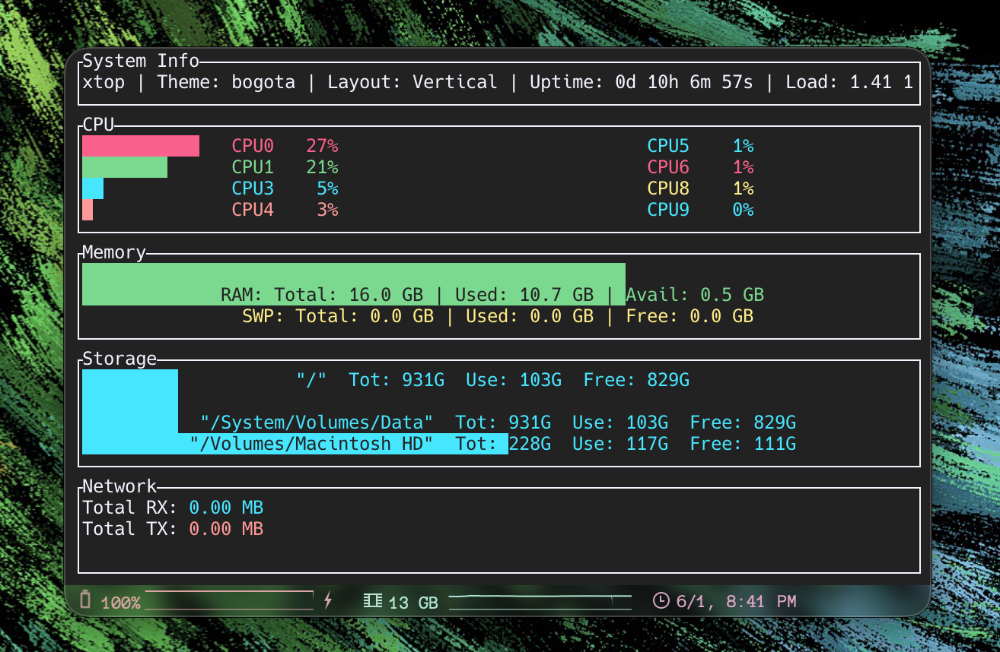

<h1 align="center">Xtop</h1>

<div align="center">


xtop is a modern, cross-platform TUI system monitor crafted in Rust. Heavily inspired by btop, it leverages Rust's safety and performance, powered by <a href="https://ratatui.rs">ratatui</a> for the interface and <a href="https://github.com/GuillaumeGomez/sysinfo">sysinfo</a> for real-time metrics.

</div>

<p align="center"></p>

---

## Table of Contents

- [Features](#features)
- [Previews](#previews)
- [Installation](#installation)
  - [Quick Install (macOS/Linux)](#quick-install-macoslinux)
  - [Quick Install (Windows PowerShell)](#quick-install-windows-powershell)
  - [Build from Source](#build-from-source)
- [Usage](#usage)
  - [Keybindings](#keybindings)
  - [Modules](#modules)
  - [Help Overlay](#help-overlay)
- [Customization](#customization)
- [Command Palette](#command-palette)
- [Configuration](#configuration)
- [Contributing](#contributing)
- [License](#license)

---

<h2 id="features">Features</h2>

<ul>
  <li><strong>Cross-Platform:</strong> Runs on macOS, Linux, and Windows.</li>
  <li><strong>System Monitoring:</strong>
    <ul>
      <li><strong>CPU:</strong> Usage per core/thread, maximum temperature sensing.</li>
      <li><strong>Memory:</strong> RAM and Swap usage with historical graphing.</li>
      <li><strong>Network:</strong> Real-time upload and download tracking per interface.</li>
      <li><strong>Disks:</strong> Storage usage visualization with per-mount-point gauges.</li>
      <li><strong>Disk I/O:</strong> Read/write speed tracking per disk.</li>
      <li><strong>Processes:</strong> List of running processes sorted by CPU usage with live search.</li>
      <li><strong>GPU:</strong> Usage gauges (stub — ready for NVIDIA/AMD).</li>
      <li><strong>Battery:</strong> Charge level gauges (stub — ready for laptop support).</li>
    </ul>
  </li>
  <li><strong>Theming:</strong>
    <ul>
      <li>13 ready-to-use color schemes + custom themes via JSONC files.</li>
      <li>Cycle through themes instantly with <kbd>t</kbd> / <kbd>T</kbd>.</li>
    </ul>
  </li>
  <li><strong>Layouts:</strong>
    <ul>
      <li>7 built-in layouts (Dashboard, Vertical, Horizontal, CPU/Memory/Network/Process Focus).</li>
      <li>Custom layouts via JSONC files — define your own widget tree.</li>
      <li>Full-screen mode for any widget.</li>
      <li>Responsive design that adapts to terminal size.</li>
    </ul>
  </li>
  <li><strong>Alert Thresholds:</strong> Visual warnings when CPU, memory, or disk usage exceeds configurable limits.</li>
  <li><strong>Persistence:</strong> Saves your theme, layout, and configuration automatically on quit.</li>
</ul>

---

<h2 id="previews">Previews</h2>

<p align="center">
  <a href="./assets/previews/preview1.png">
    
  </a>
</p>

<details>
  <summary>More previews</summary>

  <table>
    <tr>
      <td align="center">
        <a href="./assets/previews/preview2.png">
          
        </a>
      </td>
      <td align="center">
        <a href="./assets/previews/preview3.png">
          
        </a>
      </td>
    </tr>
    <tr>
      <td align="center">
        <a href="./assets/previews/preview4.png">
          
        </a>
      </td>
      <td align="center">
      </td>
    </tr>
  </table>
</details>

---

<h2 id="installation">Installation</h2>

<h3 id="quick-install-macoslinux">Quick Install (macOS/Linux)</h3>

<p>The installer script automatically detects your distribution and installs all required dependencies (including Rust if needed).</p>

<p><strong>Install with curl:</strong></p>

```bash
curl -fsSL https://raw.githubusercontent.com/xscriptor/xtop/main/install.sh | bash
```

<p><strong>Or with wget:</strong></p>

```bash
wget -qO- https://raw.githubusercontent.com/xscriptor/xtop/main/install.sh | bash
```

<p><strong>Uninstall:</strong></p>

```bash
curl -fsSL https://raw.githubusercontent.com/xscriptor/xtop/main/install.sh | bash -s -- --uninstall
```

<details>
<summary>Installer Options</summary>

<p>You can also run the installer with additional options:</p>

```bash
# Check dependencies without installing
./install.sh --check-deps

# Install only dependencies (Rust, build tools)
./install.sh --install-deps

# Show help
./install.sh --help
```

<p><strong>Supported distributions:</strong> Arch, Debian/Ubuntu, Fedora/RHEL, openSUSE, Alpine, and derivatives.</p>

</details>

<h3 id="quick-install-windows-powershell">Quick Install (Windows PowerShell)</h3>

<p>Requires <a href="https://rustup.rs/">Rust (Cargo)</a> installed. Run in PowerShell:</p>

<p><strong>Install:</strong></p>

```powershell
irm https://raw.githubusercontent.com/xscriptor/xtop/main/install.ps1 | iex
```

<p><strong>Uninstall:</strong></p>

```powershell
irm https://raw.githubusercontent.com/xscriptor/xtop/main/uninstall.ps1 | iex
```

<h3 id="build-from-source">Build from Source</h3>

<ol>
  <li>Clone the repository:
    <div class="highlight highlight-source-shell notranslate position-relative overflow-auto">

```bash
git clone https://github.com/xscriptor/xtop.git
cd xtop
```

    </div>
  </li>
  <li>Build and run:

```bash
cargo run --release
```

  </li>
</ol>

---

<h2 id="usage">Usage</h2>

<h3 id="keybindings">Keybindings</h3>

<table>
  <thead>
    <tr>
      <th>Key</th>
      <th>Action</th>
    </tr>
  </thead>
  <tbody>
    <tr>
      <td><kbd>q</kbd></td>
      <td>Quit application (saves config)</td>
    </tr>
    <tr>
      <td><kbd>?</kbd></td>
      <td>Toggle help overlay</td>
    </tr>
    <tr>
      <td><kbd>t</kbd></td>
      <td>Next color theme</td>
    </tr>
    <tr>
      <td><kbd>T</kbd></td>
      <td>Previous color theme</td>
    </tr>
    <tr>
      <td><kbd>l</kbd></td>
      <td>Next layout mode (built-in + custom)</td>
    </tr>
    <tr>
      <td><kbd>f</kbd></td>
      <td>Toggle fullscreen for current widget</td>
    </tr>
    <tr>
      <td><kbd>F</kbd></td>
      <td>Cycle fullscreen through widgets</td>
    </tr>
    <tr>
      <td><kbd>/</kbd></td>
      <td>Search / filter processes</td>
    </tr>
    <tr>
      <td><kbd>Esc</kbd></td>
      <td>Cancel search / close help overlay</td>
    </tr>
  </tbody>
</table>

<h3 id="modules">Modules</h3>

<ol>
  <li><strong>Header:</strong> Shows system uptime, load average, current theme, and layout mode.</li>
  <li><strong>CPU:</strong> Shows usage bars for each CPU core. If sensors are available, shows the maximum CPU temperature.</li>
  <li><strong>Memory:</strong> Gauges for RAM and Swap usage, plus a line chart for RAM history.</li>
  <li><strong>Storage:</strong> Disk usage gauges per mount point.</li>
  <li><strong>Network:</strong> Total downloaded (RX) and uploaded (TX) data per interface.</li>
  <li><strong>Disk I/O:</strong> Read/write speeds per disk device.</li>
  <li><strong>Processes:</strong> A scrolling list of the top 50 processes sorted by CPU usage, with live search.</li>
  <li><strong>GPU:</strong> GPU usage gauges (available on supported hardware).</li>
  <li><strong>Battery:</strong> Battery charge level gauges (available on supported hardware).</li>
</ol>

<h3 id="help-overlay">Help Overlay</h3>

<p>Press <kbd>?</kbd> at any time to show a full list of available keybindings directly on screen. Press <kbd>?</kbd> again or <kbd>Esc</kbd> to close.</p>

---

<h2 id="customization">Customization</h2>

<p>xtop supports custom color themes and layout modes defined as JSONC files.</p>

<p><strong><a href="docs/customization.md">→ Full customization guide</a></strong></p>

<table>
  <thead>
    <tr>
      <th>Feature</th>
      <th>Location</th>
      <th>Format</th>
    </tr>
  </thead>
  <tbody>
    <tr>
      <td>Themes</td>
      <td><code>~/.config/xtop/themes/*.jsonc</code></td>
      <td>16-entry hex color palette</td>
    </tr>
    <tr>
      <td>Layouts</td>
      <td><code>~/.config/xtop/layouts/*.jsonc</code></td>
      <td>Recursive split/widget tree</td>
    </tr>
  </tbody>
</table>

<p>The built-in <code>x</code> theme (almost-black background, purple-pink accents) is always available. Starter theme and layout files ship in the <code>assets/</code> directory.</p>

---

<h2 id="command-palette">Command Palette</h2>

<p>xtop provides an interactive search overlay for filtering processes in real time:</p>

<ul>
  <li>Press <kbd>/</kbd> to open the search bar at the top of the process list.</li>
  <li>Type any query — results filter instantly by process name.</li>
  <li>Press <kbd>Enter</kbd> to confirm the filter, <kbd>Esc</kbd> to cancel, <kbd>Backspace</kbd> to delete characters.</li>
  <li>A centered overlay with <code>/query_</code> indicator shows the current search input.</li>
</ul>

<p>The help overlay (<kbd>?</kbd>) serves as a quick-reference command palette for all available keybindings and actions.</p>

---

<h2 id="configuration">Configuration</h2>

<p>xtop automatically saves its configuration on quit. The configuration file is located at:</p>

<pre><code>~/.config/xtop/config.json</code></pre>

<p>Persisted settings include:</p>

<ul>
  <li>Current theme</li>
  <li>Current layout mode</li>
  <li>Update interval</li>
  <li>History points (for RAM chart)</li>
  <li>Alert thresholds (CPU, memory, disk)</li>
</ul>

<p>For custom themes and layouts, see the <a href="docs/customization.md">customization guide</a>.</p>

---

<h2 id="roadmap">Roadmap</h2>

<p>See the <a href="ROADMAP.md">ROADMAP.md</a> for planned features and upcoming milestones.</p>

---

<h2 id="changelog">Changelog</h2>

<p>See the <a href="CHANGELOG.md">CHANGELOG.md</a> for detailed release notes.</p>

---

<h2 id="contributing">Contributing</h2>

<p>Contributions are always welcome! Please read the <a href="CONTRIBUTING.md">contribution guidelines</a> first.</p>

---

<h2 id="license">License</h2>

<p><a href="LICENSE">MIT</a></p>

<div align="center">
  <a href="https://github.com/xscriptor">---X---</a>
</div>
